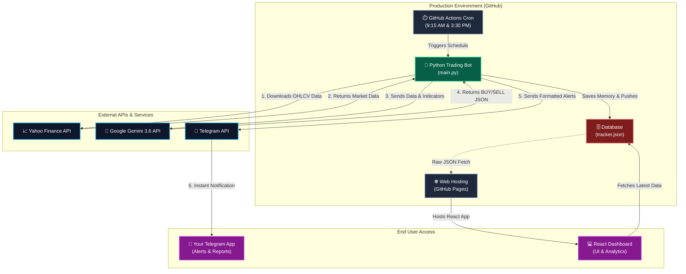

# Share Market Bot - Production Architecture

This diagram illustrates how your entire quantitative trading firm operates seamlessly in the cloud for free using GitHub Actions, Gemini AI, and GitHub Pages.

## How the pieces fit together:
1. **The Scheduler:** GitHub Actions wakes up the **Python Bot** every weekday at 9:15 AM (Analysis) and 3:30 PM (Evaluation).
2. **The Intelligence:** The bot pulls live market data from **Yahoo Finance** and passes it securely to **Google Gemini AI**.
3. **The Memory:** Once the AI makes a decision, the bot writes the trade to `tracker.json` and automatically commits this file back to your GitHub repository so it never forgets its history.
4. **The Alerts:** The bot immediately forwards the signals and accuracy reports to your phone via **Telegram**.
5. **The Interface:** When you open your web browser, the **React Dashboard** (hosted on GitHub Pages) reads the `tracker.json` file straight from the repository, generating a beautiful UI with your active trades and historical Analytics.
